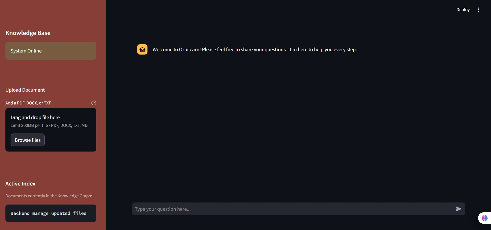

# RAG_CHAT_BOT

[](https://github.com/facebookresearch/faiss)
[](https://pypi.org/project/python-dotenv/)
[](https://fastapi.tiangolo.com/)
[](https://www.uvicorn.org/)
[](https://pypi.org/project/python-multipart/)

[](https://www.langchain.com/)
[](https://pypi.org/project/langchain-google-genai/)
[](https://pypi.org/project/langchain-community/)

[](https://pypi.org/project/pypdf/)
[](https://pypi.org/project/docx2txt/)
[](https://pypi.org/project/tiktoken/)


A powerful, privacy-focused **Retrieval-Augmented Generation (RAG)** chatbot. This system allows users to chat with their internal documents (PDFs, Word docs, text files) using gemini 1.5 flash model via geamini-api. No data leaves your network.

The project runs on a modern client-server architecture, separating the Streamlit frontend from the FastAPI backend.

The High-Level Design (HLD) follows a robust Client-Server Architecture decoupling the interface from logic.

Frontend (Streamlit): A lightweight UI for user chat and file uploads, communicating strictly via REST APIs.

Backend (FastAPI): The central orchestrator handling business logic, serving as a "Shared Service" for data processing.

Dual Ingestion Strategy: The system uniquely supports two data entry points:

User Path: Real-time uploads via the Frontend API.

Admin Path: Bulk ingestion via a backend script.
Both paths converge on a unified Ingestion Engine, ensuring consistent processing (chunking/embedding) into the FAISS VectorDB and gemini model.

---


---

# BACKEND
```File Structure

backend/
├── documents_to_add/     # for bulk document upload (Admin side)
├── temp_upload/          # upload documents via /upload API
├── add_bulk.py           # add bulk documents (Admin side)
├── main.py               # FastAPI routes
├── ragservice.py         # RAG implementation
└── requirements.txt      # All required packages
|__ .env                  # define gemini_api_key =


## Installation

First, install all required packages using:

bash
pip install -r requirements.txt


Run Project
uvicorn main:app --reload --host 0.0.0.0 --port 8000
```

Before run Backend make sure put the gemini api key in .env file gemini_api_key =(your API key)

# You can add documents in backend admin side vis "http://127.0.0.1:8000/update" or "http://127.0.0.1:8000/docs"
---

---

# FRONTEND

---
The Frontend is built with Streamlit, serving as a lightweight Client-Side interface. It handles user interactions—specifically chatting and file uploads—and forwards them to the backend via REST API calls. It contains no business logic, acting purely as a presentation layer to visualize the RAG system's responses.

run the backend using bellow comand
'''
streamlit run app.py
'''

---

---

```File Structure

backend/
├── .env     # BACKEND_URL = "http://127.0.0.1:8000" take backend API
├── app.py    # all streamlit code

```
# NOTE:
  Make sure always check backend run which port and define this in .env file in frontned
  make sure after running faiss_index created automaticaly don`t need to create file( for more look at .gitignore)
